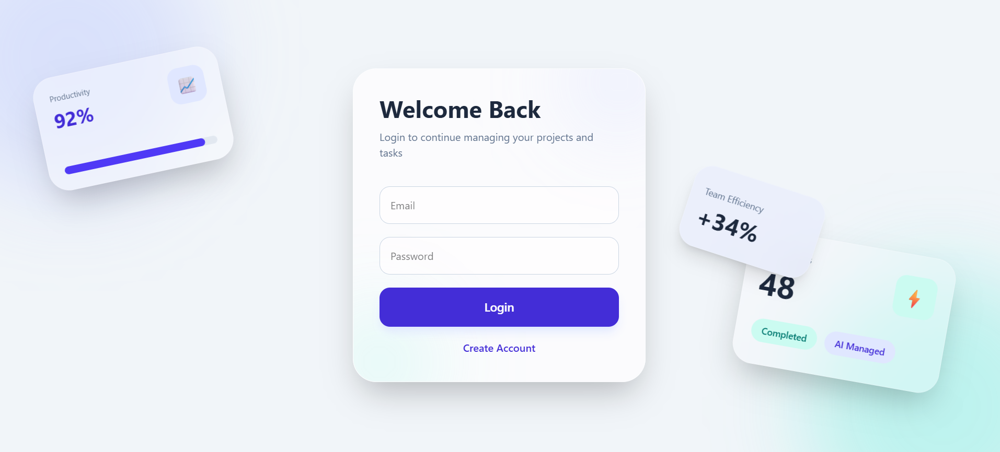
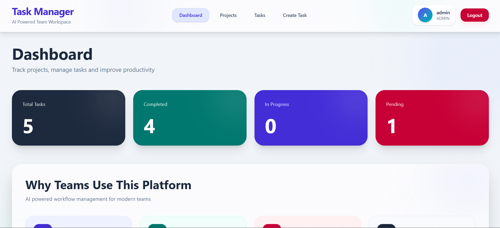
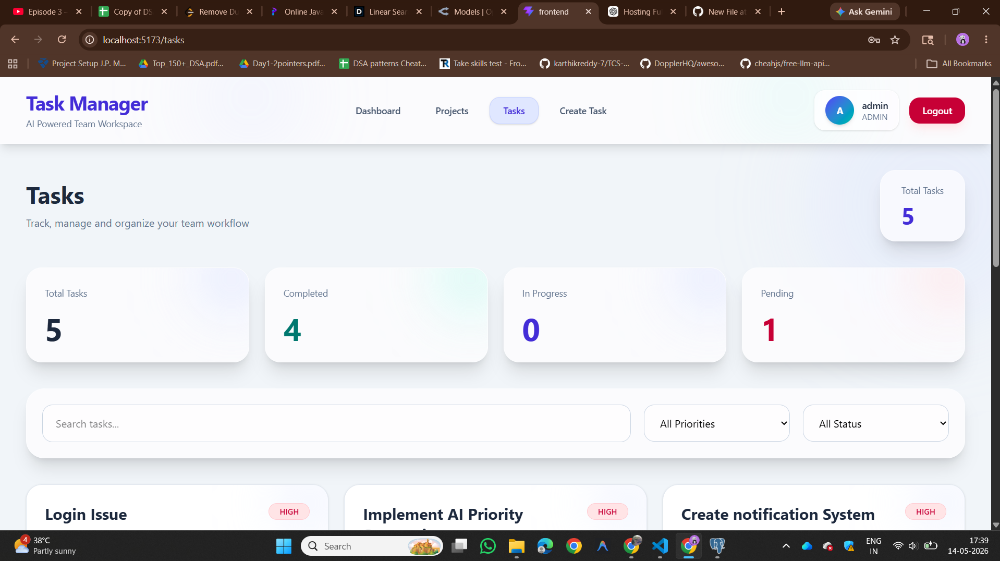
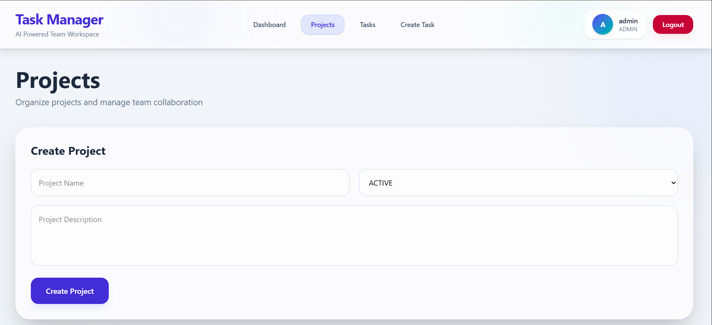
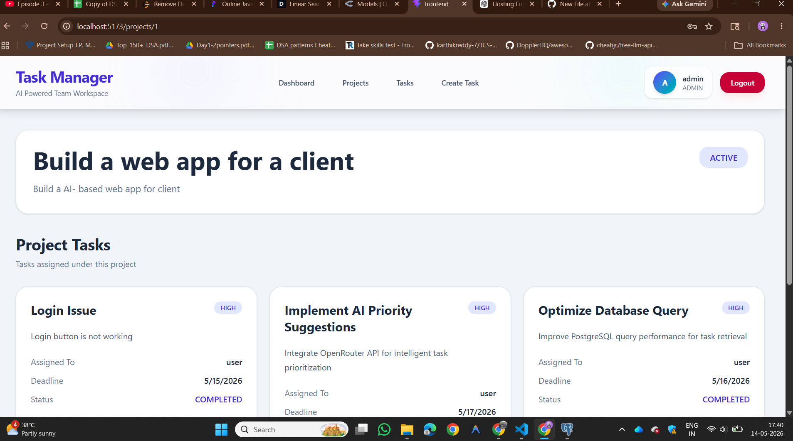

# AI Powered Team Task Management System

A modern full-stack task and project management web application built using React, FastAPI, PostgreSQL, and OpenAI-powered AI features.

This platform helps teams and admins manage projects, assign tasks, track deadlines, monitor productivity, and improve workflow efficiency through an intuitive and responsive dashboard.

---

# Features

## Authentication & Security

* JWT Authentication
* Secure Login & Signup
* Protected Routes
* Password Hashing using bcrypt
* Role-based backend structure

---

# Project Management

* Create Projects
* Project Status Management
* Search & Filter Projects
* Project Details Page
* View all tasks inside a project

---

# Task Management

* Create Tasks
* Assign tasks to users
* Task Status Updates
* Task Priority Levels
* Task Deadlines
* Overdue Task Detection
* Due Today Highlight
* Search & Filter Tasks

---

# AI Features

## AI Priority Suggestion

Automatically predicts task priority using AI based on task description.

Example:

* HIGH
* MEDIUM
* LOW

Powered using OpenRouter + NVIDIA Nemotron Model.

---

# Dashboard Analytics

* Total Tasks
* Completed Tasks
* Pending Tasks
* In Progress Tasks
* Dynamic Statistics
* Productivity Insights

---

# Responsive UI

* Modern SaaS Inspired Design
* Glassmorphism UI
* Responsive Layouts
* Mobile Friendly Components
* Interactive Cards & Filters

---

# Tech Stack

## Frontend

* React.js
* React Router DOM
* Tailwind CSS
* Axios
* Vite

---

## Backend

* FastAPI
* SQLAlchemy
* Pydantic
* JWT Authentication
* Passlib
* PostgreSQL

---

## AI Integration

* OpenRouter API
* NVIDIA Nemotron Model

---

# Folder Structure

```bash
TeamTaskManagement.app/
│
├── Backend/
│   ├── app/
│   ├── main.py
│   ├── requirements.txt
│   └── .env
│
├── Frontend/
│   ├── src/
│   ├── package.json
│   └── vite.config.js
│
└── README.md
```

---

# Environment Variables

## Backend `.env`

```env
DATABASE_URL=
SECRET_KEY=
ALGORITHM=HS256
OPENAI_API_KEY=
```

---

# Installation & Setup

## Clone Repository

```bash
git clone <your-repository-url>
cd TeamTaskManagement.app
```

---

# Backend Setup

```bash
cd Backend

python -m venv venv

venv\Scripts\activate

pip install -r requirements.txt
```

Run Backend:

```bash
uvicorn main:app --reload
```

Backend runs on:

```bash
http://127.0.0.1:8000
```

---

# Frontend Setup

```bash
cd Frontend

npm install
```

Run Frontend:

```bash
npm run dev
```

Frontend runs on:

```bash
http://localhost:5173
```

---

# Deployment

## Hosting

* Frontend → Railway
* Backend → Railway
* Database → Railway PostgreSQL

---

# Screenshots

# Screenshots

## Login Page



---

## Dashboard



---

## Tasks Page



---

## Projects Page



---

## Project Details



---

# Future Improvements

* Kanban Board
* Toast Notifications
* Team Analytics
* Dark Mode
* Calendar View
* File Upload Support
* Real-time Notifications

---

# Author

Developed as a full-stack portfolio project demonstrating:

* frontend development
* backend API development
* authentication
* database management
* AI integration
* responsive UI design
* full-stack architecture

---

# License

This project is for educational and portfolio purposes.
